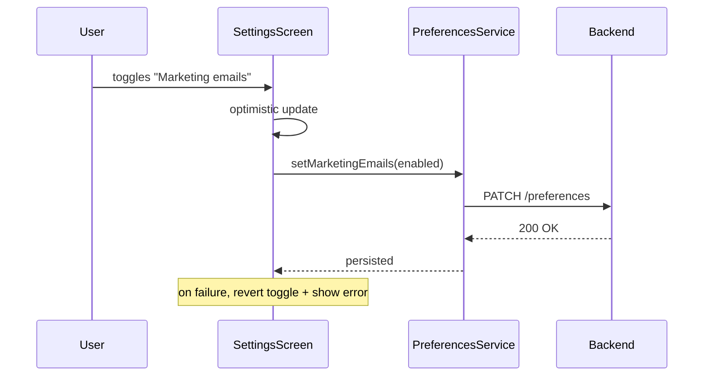

# Technical Plan

## Architecture

The toggle is a controlled component on the existing Settings screen. It
reads its initial value from the `preferences` service (server-backed) and
writes optimistically on change, reverting on a failed save. No new screens
or navigation are introduced.

## Diagram

## Impacted files

- `services/preferences.ts` — add `setMarketingEmails(enabled: boolean)` and include the field in `getPreferences()`.
- `app/(tabs)/settings.tsx` — add the "Marketing emails" row wired to the service.
- `i18n/locales/en.ts` — add `settings.marketing.*` keys.
- `i18n/locales/fr.ts` — add `settings.marketing.*` keys.

## Existing patterns to reuse

- `NotificationToggle` in `settings.tsx` already implements optimistic-update-with-revert; follow it.

## Risks

- A slow backend makes the optimistic update feel wrong; keep the revert path visible.

## Implementation order

1. Add i18n keys (en, fr).
2. Add `setMarketingEmails` to the preferences service.
3. Add the UI row wired to the service, mirroring `NotificationToggle`.
4. Emit the `settings_marketing_toggled` analytics event.

## Testing strategy

- AC1/AC2: integration test on the service round-trip.
- AC3: simulate a failed PATCH, assert the toggle reverts and the error shows.

## Task breakdown

- [ ] i18n keys
- [ ] service method
- [ ] UI row
- [ ] analytics event
