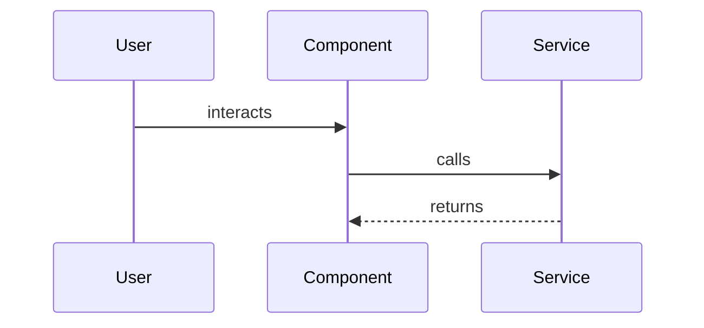

# Technical Plan

## Architecture

One paragraph describing how the feature fits into the existing app structure.

## Diagram

A Mermaid diagram is mandatory — sequence diagram for a new interaction/API flow, component/flowchart for new UI or data flow. Review checks the implementation against this, not just the prose above.

## Impacted Files

- `path/to/file.ts` — description of changes

## Existing Patterns To Reuse

- Reference specific components, hooks, or services

## Risks

- Things that could go wrong

## Implementation Order

1. Step 1
2. Step 2

## Testing Strategy

- How to verify each acceptance criterion

## Task Breakdown

- [ ] Task 1
- [ ] Task 2
